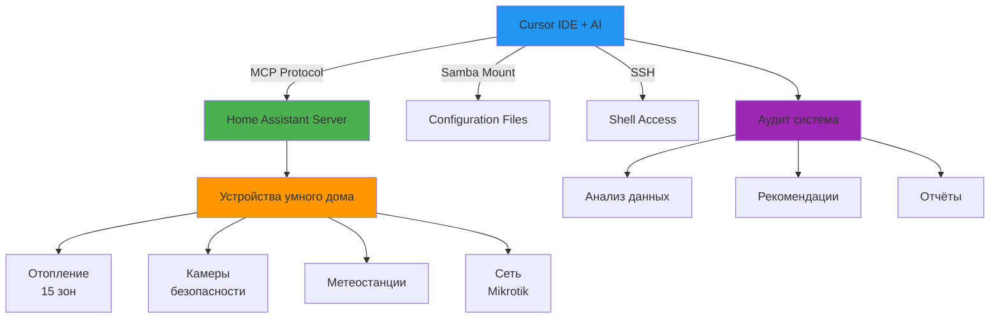

# 🏠 Home Assistant Audit & Configuration Framework

Профессиональная среда разработки для Home Assistant с AI-ассистентом через Cursor IDE

---

## ✨ Возможности

<div class="grid cards" markdown>

- :material-robot:{ .lg .middle } __AI-Ассистент__

    ---

    Управление устройствами умного дома прямо из Cursor через Model Context Protocol (MCP)

- :material-pencil:{ .lg .middle } __Real-time редактирование__

    ---

    Монтирование конфигурации через Samba - изменения применяются мгновенно

- :material-shield-check:{ .lg .middle } __Безопасность__

    ---

    Автоматическая защита от утечки данных, SSH ключи, валидация перед коммитами

- :material-chart-line:{ .lg .middle } __Аудит системы__

    ---

    Комплексный анализ умного дома с рекомендациями от консилиума экспертов

- :material-backup-restore:{ .lg .middle } __Бэкапы__

    ---

    Автоматические бэкапы перед изменениями, быстрое восстановление

- :material-git:{ .lg .middle } __Версионирование__

    ---

    Git-интеграция с защитой чувствительных данных

</div>

---

## 🚀 Быстрый старт

```bash
# 1. Установка (один раз)
./scripts/setup.sh

# 2. Главное меню (всё управление здесь!)
./ha
```

__Вот и всё!__ Система готова к работе.

---

## 📊 Архитектура системы



---

## 🎯 Основные функции

### 1. Интерактивное меню `./ha`

Все операции в одном месте:

- ⚙️ Настройка режима (локальный/глобальный/смешанный)
- 🔌 Монтирование конфигурации
- 🔍 Проверка статуса
- 🚀 Безопасное развёртывание
- 💾 Бэкапы и восстановление
- 🔬 __Аудит системы__

### 2. Аудит умного дома

Комплексный анализ от консилиума экспертов:

- 🌡️ __Климат-контроль__ - эффективность отопления
- 🔒 __Безопасность__ - камеры, датчики, сигнализация
- 📡 __Сеть__ - состояние роутеров и точек доступа
- ⚡ __Энергетика__ - потенциал экономии
- 🎛️ __Автоматизация__ - оптимизация сценариев
- 📊 __Мониторинг__ - метрики здоровья системы

__Пример вывода:__

```
✅ Здоровье системы: 65% → Потенциал: 90%
⚠️ Найдено 70+ unavailable устройств
💡 Экономия отопления: до 25% при правильной настройке
```

### 3. Безопасное развёртывание

Автоматический workflow:

1. ✅ Создание бэкапа
2. ✅ Валидация YAML
3. ✅ Проверка конфигурации HA
4. ✅ Коммит в Git
5. ✅ Перезапуск HA
6. ✅ Проверка работоспособности

---

## 📚 Документация

<div class="grid cards" markdown>

- :material-rocket-launch:{ .lg .middle } [Быстрый старт](setup/quickstart.md)

    Установка и первая настройка за 5 минут

- :material-book-open:{ .lg .middle } [Подробная установка](setup/SETUP.md)

    Пошаговая инструкция с командами для копирования

- :material-script:{ .lg .middle } [Справочник команд](reference/COMMANDS.md)

    Все доступные скрипты и их параметры

- :material-chart-donut:{ .lg .middle } [Первый аудит](guides/first-audit.md)

    Как провести аудит и интерпретировать результаты

</div>

---

## 🛡️ Безопасность

Все чувствительные данные защищены:

- ✅ `config.yml` - ваши данные (в `.gitignore`)
- ✅ `.cursor/mcp.json` - MCP токен (в `.gitignore`)
- ✅ `.ssh/` - SSH ключи (в `.gitignore`)
- ✅ `audits/` - отчёты с реальными данными (в `.gitignore`)

__Автоматическая проверка:__

```bash
./scripts/check_security.sh  # Проверка перед коммитом
```

---

## 🌟 Примеры использования

### Оптимизация отопления

```yaml
automation:
  - alias: "Погодозависимая кривая отопления"
    trigger:
      - platform: state
        entity_id: sensor.outdoor_temperature
    action:
      - service: climate.set_temperature
        data:
          temperature: >
            
            {{ 25 - (outdoor * 0.5) }}
```

### Мониторинг безопасности

```yaml
automation:
  - alias: "Тревога: Человек на периметре"
    trigger:
      - platform: state
        entity_id: binary_sensor.street_ptz_smart_motion_human
        to: "on"
    condition:
      - condition: time
        after: "22:00:00"
        before: "06:00:00"
    action:
      - service: notify.telegram
        data:
          message: "Обнаружен человек возле дома!"
```

---

## 💬 Сообщество

- 🐛 [Сообщить об ошибке](https://github.com/Gfermoto/HASSio_Cursor/issues)
- 💡 [Предложить улучшение](https://github.com/Gfermoto/HASSio_Cursor/issues)
- ⭐ [Поставить звезду на GitHub](https://github.com/Gfermoto/HASSio_Cursor)

---

## 📄 Лицензия

MIT License - используйте свободно!

---

!!! tip "Совет"
    Начните с [Быстрого старта](setup/quickstart.md), затем проведите [Первый аудит](guides/first-audit.md) чтобы оценить состояние вашей системы!
