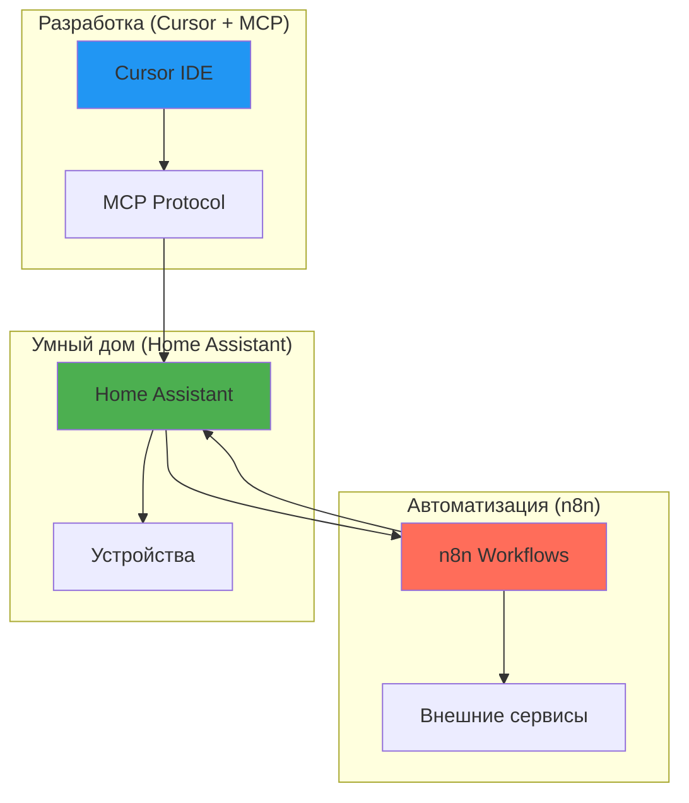

# 🔗 Интеграция n8n с Home Assistant

Руководство по подключению n8n для расширенных автоматизаций и интеграций.

> **🎯 Навигация:**
>
> - [🤵 Пошаговое развертывание](./n8n-butler-setup.md) - быстрый старт (20 мин)
> - [🤖 AI Агенты n8n](./n8n-ai-agents.md) - примеры 7 агентов с кодом

---

## 📋 Содержание

- [🎯 Зачем n8n если есть MCP?](#зачем-n8n-если-есть-mcp)
- [🏗️ Архитектура интеграции](#архитектура-интеграции)
- [⚙️ Подключение n8n](#подключение-n8n)
- [💡 Рекомендуемые сценарии](#рекомендуемые-сценарии)
- [🔧 Практические примеры](#практические-примеры)
- [🐛 Troubleshooting](#troubleshooting)

---

## 🎯 Зачем n8n если есть NodeRED и MCP?

### Ваша текущая инфраструктура

**Что уже работает:**

- ✅ **Home Assistant** - управление устройствами
- ✅ **NodeRED** - автоматизации и flow
- ✅ **HA Addons** - бэкапы, Telegram, Samba
- ✅ **MCP (Cursor)** - AI помощь в разработке

**Зачем еще n8n?**

→ **Только для AI агентов** с локальными LLM (бесплатно, работает в РФ)!

### MCP (Model Context Protocol) - для AI взаимодействия

**Что делает MCP:**

- 🤖 AI управление устройствами через Cursor
- 💬 Естественный язык → команды HA
- 🔍 Быстрый доступ к состоянию устройств
- 📝 Помощь в написании автоматизаций

**Ограничения MCP:**

- ❌ Только в Cursor IDE
- ❌ Нет планировщика задач
- ❌ Нет интеграций с внешними сервисами
- ❌ Не работает автономно

### n8n - для автоматизации, интеграций и AI агентов

**Что делает n8n:**

- 🔄 Автоматизация между сервисами
- ⏰ Планировщик задач (cron)
- 🌐 Интеграции с 400+ сервисами
- 📊 Сложная логика и обработка данных
- 🔁 Работает 24/7 автономно
- 🤖 **AI Agents** - интеграция с OpenAI, Anthropic, локальными LLM
- 🧠 **Langchain** - создание AI цепочек и агентов
- 💬 **Conversational AI** - чат-боты и ассистенты

**Особенности n8n:**

- ✅ **AI-powered workflows** - встроенная поддержка LLM
- ✅ **Векторные базы** - для RAG (Retrieval-Augmented Generation)
- ✅ **Memory** - сохранение контекста разговоров
- ⚠️ Требует отдельный сервер (Docker/VPS)

### 🎯 Идеальная комбинация



**Используйте вместе:**

- **MCP (в Cursor)** - для разработки и отладки конфигураций HA
  - AI помощь в написании YAML
  - Быстрое тестирование команд
  - Интерактивная разработка

- **n8n** - для продакшн автоматизаций и AI агентов
  - Сложные workflows с AI обработкой
  - Автономные AI агенты
  - Интеграции с внешними сервисами
  - Работает 24/7 без вашего участия

- **Home Assistant** - как центральный hub устройств
  - Локальное управление
  - Быстрые реакции
  - Надежность и offline работа

---

## 🏗️ Архитектура интеграции

### Три способа взаимодействия

#### 1. Home Assistant → n8n (Webhooks)

```yaml
# HA automation
automation:
  - alias: "Триггер n8n workflow"
    trigger:
      - platform: state
        entity_id: sensor.outdoor_temperature
        to: "below"
        value_template: "{{ states('input_number.heating_threshold') }}"
    action:
      - service: notify.n8n_webhook
        data:
          message: "Temperature alert"
          temperature: "{{ states('sensor.outdoor_temperature') }}"
```

#### 2. n8n → Home Assistant (REST API)

```json
// n8n HTTP Request node
{
  "method": "POST",
  "url": "http://192.168.1.20:8123/api/services/climate/set_temperature",
  "headers": {
    "Authorization": "Bearer YOUR_HA_TOKEN",
    "Content-Type": "application/json"
  },
  "body": {
    "entity_id": "climate.living_room",
    "temperature": 22
  }
}
```

#### 3. Двусторонняя синхронизация

```text
HA Event → Webhook → n8n → Обработка → REST API → HA Action
```

---

## ⚙️ Подключение n8n

### Шаг 1: Настройка Home Assistant

#### 1.1. Создать Long-Lived Access Token

1. Откройте Home Assistant
2. Перейдите в профиль (левый нижний угол)
3. Прокрутите вниз до **Long-Lived Access Tokens**
4. Нажмите **CREATE TOKEN**
5. Название: `n8n Integration`
6. Скопируйте токен (больше не покажется!)

#### 1.2. Настроить Webhook в HA (опционально)

Если хотите триггерить n8n из HA:

```yaml
# configuration.yaml
notify:
  - name: n8n_webhook
    platform: rest
    resource: "http://192.168.1.XXX:5678/webhook/ha-trigger"
    method: POST_JSON
    headers:
      Content-Type: application/json
    message_param_name: message
```

Замените:

- `192.168.1.XXX` на IP вашего n8n сервера
- `ha-trigger` на ID вашего webhook в n8n

### Шаг 2: Настройка n8n

#### 2.1. Создать Credential для Home Assistant

В n8n:

1. Откройте **Credentials**
2. Нажмите **Add Credential**
3. Выберите **Home Assistant API**
4. Заполните:
   - **Name**: `Home Assistant`
   - **Host**: `http://192.168.1.20:8123` (ваш HA)
   - **Access Token**: токен из шага 1.1
5. **Save**

#### 2.2. Создать тестовый Workflow

1. **New Workflow**
2. Добавьте ноды:
   - **Webhook** (триггер)
   - **Home Assistant** (получить состояние)
   - **Switch** (условие)
   - **Home Assistant** (выполнить действие)
3. **Save** → **Activate**

### Шаг 3: Добавить n8n в проект HASSio_Cursor

#### 3.1. Обновить config.yml

Добавьте секцию в `config.yml`:

```yaml
# n8n Integration
n8n:
  enabled: true
  url_local: "http://192.168.1.XXX:5678"
  url_external: "https://n8n.yourdomain.com"  # Если есть
  api_key: "your_n8n_api_key"  # Из n8n: Settings → API
  webhooks:
    base_url: "http://192.168.1.XXX:5678/webhook"
    ha_trigger: "ha-trigger"  # ID webhook для триггеров из HA
```

Замените:

- `192.168.1.XXX` на IP вашего n8n
- `your_n8n_api_key` на API ключ из n8n

#### 3.2. Проверка подключения

Создайте тестовый скрипт:

```bash
#!/bin/bash
# scripts/check_n8n.sh

source "$(dirname "$0")/lib_config.sh"

echo "🔍 Проверка подключения к n8n..."
echo ""

# Проверка доступности
if curl -s -f "$N8N_URL/healthz" > /dev/null 2>&1; then
    echo "✅ n8n доступен: $N8N_URL"
else
    echo "❌ n8n недоступен: $N8N_URL"
    exit 1
fi

# Проверка API
response=$(curl -s -H "X-N8N-API-KEY: $N8N_API_KEY" \
    "$N8N_URL/api/v1/workflows" 2>/dev/null)

if [ $? -eq 0 ]; then
    workflow_count=$(echo "$response" | jq -r '.data | length' 2>/dev/null || echo "?")
    echo "✅ API работает"
    echo "📊 Активных workflows: $workflow_count"
else
    echo "❌ API не отвечает (проверьте API ключ)"
    exit 1
fi

echo ""
echo "✅ Интеграция n8n настроена корректно!"
```

Использование:

```bash
chmod +x scripts/check_n8n.sh
./scripts/check_n8n.sh
```

---

## 💡 Рекомендуемые сценарии

### 🌡️ 1. Умная оптимизация отопления (15 зон!)

**Проблема:**
HA автоматизации ограничены в сложных расчетах погодной компенсации.

**Решение через n8n:**

```text
n8n Workflow: "Smart Heating Optimization"

Триггер: Cron (каждые 30 минут)
  ↓
Нода: HTTP Request → API прогноза погоды (Gismeteo/OpenWeatherMap)
  ↓
Нода: Function → Расчет погодозависимой кривой
  Входные: outdoor_temp_forecast, wind, humidity
  Алгоритм: target = 25 - (outdoor * 0.5) - (wind * 0.1)
  Выход: temperature_targets для каждой зоны
  ↓
Нода: Loop через 15 зон → Home Assistant API
  climate.set_temperature для каждой зоны
  ↓
Нода: Telegram → Отчет об оптимизации
  "Температуры обновлены. Экономия: ~150 руб/день"
```

**Преимущества:**

- ✅ Сложные расчеты вне HA
- ✅ Интеграция с любыми API погоды
- ✅ Легко модифицировать алгоритм
- ✅ Логирование и аналитика

### 📹 2. Интеллектуальные алерты с камер

**Проблема:**
Много ложных срабатываний от датчиков движения.

**Решение через n8n:**

```text
n8n Workflow: "Smart Camera Alerts"

Триггер: Webhook от HA (binary_sensor.motion = on)
  ↓
Нода: Home Assistant → Получить историю за последний час
  ↓
Нода: Function → Анализ паттернов
  Если срабатываний > 10 за час → вероятно ложное (животное, свет)
  Если редкое событие + ночное время → приоритет HIGH
  ↓
Нода: Switch (ветвление)
  Case 1: Ложное срабатывание → игнорировать
  Case 2: Важное событие → отправить алерт
  Case 3: Критическое → алерт + snapshot камеры
  ↓
Нода: Telegram → Уведомление с контекстом
  "🚨 Человек на периметре (редкое событие, ночь)"
  + Фото с камеры
  + История за час
```

**Преимущества:**

- ✅ Машинное обучение паттернов
- ✅ Меньше ложных тревог
- ✅ Контекстные уведомления
- ✅ История и статистика

### 📊 3. Аналитика и отчеты

**Проблема:**
HA не умеет генерировать красивые отчеты.

**Решение через n8n:**

```text
n8n Workflow: "Weekly Energy Report"

Триггер: Cron (понедельник 9:00)
  ↓
Нода: Home Assistant → Получить историю за неделю
  - sensor.energy_consumed
  - sensor.heating_power
  - sensor.lights_power
  ↓
Нода: Function → Расчеты
  - Total consumption
  - Cost calculation (тариф день/ночь)
  - Comparison с прошлой неделей
  - Top-5 потребителей
  ↓
Нода: Google Sheets → Запись данных
  История за год для анализа трендов
  ↓
Нода: HTTP Request → Chart.js API
  Генерация графиков
  ↓
Нода: Telegram → Отчет
  📊 Еженедельный отчет:
  ⚡ Потребление: 150 кВт*ч (-12% от прошлой недели)
  💰 Стоимость: 750 руб
  🔝 Топ потребитель: Отопление (60%)
  [График]
```

**Преимущества:**

- ✅ Автоматические отчеты
- ✅ Интеграция с Google Sheets/Excel
- ✅ Красивые графики
- ✅ Исторические данные

### 🔄 4. Бэкапы в облако

**Проблема:**
Локальные бэкапы не защищены от аппаратных сбоев.

**Решение через n8n:**

```text
n8n Workflow: "Cloud Backup Automation"

Триггер: Webhook от HA (после успешного backup)
  ↓
Нода: SSH → Скачать бэкап с HA
  scp root@192.168.1.20:/backup/latest.tar /tmp/
  ↓
Нода: Compression → Проверить размер
  Если > 500MB → предупреждение
  ↓
Нода: Yandex Disk / Dropbox → Загрузить
  Путь: /HomeAssistant/Backups/2025-10/
  Имя: backup-2025-10-08-12-00.tar.gz
  ↓
Нода: Function → Cleanup старых бэкапов
  Удалить бэкапы старше 30 дней
  ↓
Noda: HTTP Request → HA API
  Обновить sensor.last_cloud_backup
  ↓
Нода: Telegram → Уведомление
  "✅ Бэкап загружен в облако (150MB, 2.3 сек)"
```

**Преимущества:**

- ✅ Автоматическая загрузка
- ✅ Версионирование
- ✅ Защита от потери данных
- ✅ Уведомления

### 🤖 5. Расширенный Telegram бот

**Проблема:**
HA Telegram integration ограничен в возможностях.

**Решение через n8n:**

```text
n8n Workflow: "Advanced Telegram Bot"

Триггер: Telegram → Команды
  /status → Статус дома
  /heating <temp> → Установить температуру
  /cameras → Snapshots всех камер
  /report → Подробный отчет
  ↓
Нода: Switch → Роутинг команд
  ↓
Ветка 1: /status
  Home Assistant → Получить все состояния
  Function → Форматирование
  Telegram → Красивый статус с эмодзи и кнопками

Ветка 2: /heating
  Validation → Проверка температуры (16-26°C)
  Home Assistant → Установить climate для 15 зон
  Telegram → Подтверждение + прогноз расхода

Ветка 3: /cameras
  Loop → Получить snapshots со всех камер
  Image processing → Resize/watermark
  Telegram → Альбом фотографий

Ветка 4: /report
  Home Assistant → Получить метрики
  Function → Анализ
  Chart API → Генерация графиков
  Telegram → Отчет с графиками
```

**Преимущества:**

- ✅ Кнопки и интерактивность
- ✅ Сложная логика
- ✅ Красивое форматирование
- ✅ Графики и медиа

### 📡 6. Мониторинг внешних сервисов

**Проблема:**
HA не умеет мониторить многие сервисы (GitHub, VPS, домены).

**Решение через n8n:**

```text
n8n Workflow: "External Services Monitor"

Триггер: Cron (каждые 15 минут)
  ↓
Параллельно:

  Ветка 1: GitHub Actions
    HTTP → GitHub API
    Проверить статус последних runs
    Если failed → уведомление

  Ветка 2: SSL сертификаты
    HTTP → Check cert expiry
    Если < 7 дней → предупреждение

  Ветка 3: Внешние IP
    HTTP → myip.com
    Если изменился → обновить DNS

  Ветка 4: VPS uptime
    HTTP → Healthcheck endpoints
    Если down → алерт
  ↓
Merge → Объединить результаты
  ↓
Home Assistant → Обновить sensors
  sensor.github_status: "ok"
  sensor.ssl_expiry: 45
  sensor.external_ip: "1.2.3.4"
  ↓
Если есть проблемы → Telegram
```

**Преимущества:**

- ✅ Централизованный мониторинг
- ✅ Проактивные уведомления
- ✅ Интеграция с HA дашбордом

### ⚡ 7. Умное энергосбережение

**Проблема:**
Нужно учитывать тарифы день/ночь и прогноз потребления.

**Решение через n8n:**

```text
n8n Workflow: "Smart Power Management"

Триггер: Cron (каждый час)
  ↓
Нода: Home Assistant → Получить текущее потребление
  sensor.total_power
  ↓
Нода: HTTP → API энергосбыта (тарифы)
  Узнать текущий тариф (день/ночь/пик)
  ↓
Нода: Function → Predictive analysis
  Прогноз потребления на следующий час
  Расчет стоимости
  ↓
Нода: Switch → Решения

  Case 1: Пик + высокое потребление
    → Выключить неприоритетные устройства
    → HA: switch.water_heater = off

  Case 2: Ночной тариф + низкое потребление
    → Включить отложенные задачи
    → HA: switch.dishwasher = on (если есть программа)

  Case 3: Нормальный режим
    → Ничего не делать
  ↓
Нода: Home Assistant → Обновить input_select.power_mode
  "peak" | "night" | "normal"
  ↓
Нода: Google Sheets → Логирование
  Timestamp, consumption, tariff, cost, actions
```

**Преимущества:**

- ✅ Экономия 15-30% на электричестве
- ✅ Автоматическое управление
- ✅ Аналитика и отчеты

### 🔔 8. Агрегация уведомлений

**Проблема:**
Слишком много уведомлений от HA (спам).

**Решение через n8n:**

```text
n8n Workflow: "Smart Notification Aggregator"

Триггер: Webhook от HA (любое уведомление)
  ↓
Нода: Function → Буферизация
  Собирать уведомления в течение 5 минут
  ↓
Нода: Function → Группировка
  По типу: критичные, предупреждения, информация
  По источнику: камеры, датчики, система
  ↓
Нода: Function → Приоритезация
  Критичные: отправить сразу
  Предупреждения: батч раз в час
  Информация: батч раз в день
  ↓
Нода: Switch → По приоритету

  Critical:
    Telegram → Instant push
    + Phone call (если ночь)

  Warning:
    Telegram → Батч через час

  Info:
    Telegram → Daily digest
  ↓
Нода: Database → Логирование
  История всех уведомлений
```

**Преимущества:**

- ✅ Нет спама
- ✅ Важное приходит мгновенно
- ✅ Контекст и группировка
- ✅ История

### 🔐 9. Безопасность и мониторинг доступа

**Проблема:**
Нужно отслеживать подозрительную активность.

**Решение через n8n:**

```text
n8n Workflow: "Security Monitoring"

Триггер: Webhook от HA
  - Неудачная попытка входа
  - Новое неизвестное устройство
  - Изменение критичной автоматизации
  ↓
Нода: Function → Анализ контекста
  - Время события
  - IP адрес
  - Частота (есть ли паттерн атаки?)
  ↓
Нода: Database → Проверить blacklist
  Известные вредоносные IP
  ↓
Нода: Switch → Уровень угрозы

  High:
    → MikroTik API: блокировать IP
    → HA: включить режим тревоги
    → Telegram: критичный алерт
    → Email: детальный отчет

  Medium:
    → Telegram: предупреждение
    → Log в базу

  Low:
    → Только логирование
  ↓
Нода: Google Sheets → Security Log
  История инцидентов
```

**Преимущества:**

- ✅ Проактивная защита
- ✅ Автоматическая блокировка
- ✅ Детальное логирование

### 🌐 10. Интеграция с IoT платформами

**Use case:**
Устройства на разных платформах (Tuya, Xiaomi, Zigbee).

**Решение через n8n:**

```text
n8n Workflow: "Multi-Platform Sync"

Триггер: Cron (каждые 5 минут)
  ↓
Параллельно:

  Tuya Cloud API → Получить состояния
  Xiaomi Cloud API → Получить состояния
  MQTT → Zigbee2MQTT данные
  ↓
Merge → Объединить
  ↓
Нода: Function → Нормализация данных
  Приведение к единому формату
  ↓
Нода: Home Assistant → Обновить MQTT sensors
  Публикация в HA MQTT
  ↓
Нода: Database → Логирование
  История состояний всех устройств
```

**Преимущества:**

- ✅ Единая точка управления
- ✅ Независимость от облаков
- ✅ Историческая база данных

---

## 🔧 Практические примеры

### Пример 1: Webhook триггер из HA

**HA Automation:**

```yaml
automation:
  - alias: "Низкая температура → n8n"
    trigger:
      - platform: numeric_state
        entity_id: sensor.outdoor_temperature
        below: 0
    action:
      - service: rest_command.n8n_heating_alert
        data:
          temperature: "{{ states('sensor.outdoor_temperature') }}"
          forecast: "{{ state_attr('weather.home', 'forecast') }}"
```

**HA Configuration:**

```yaml
rest_command:
  n8n_heating_alert:
    url: "http://192.168.1.XXX:5678/webhook/heating-alert"
    method: POST
    content_type: "application/json"
    payload: >
      {
        "temperature": {{ temperature }},
        "forecast": {{ forecast }},
        "timestamp": "{{ now().isoformat() }}"
      }
```

### Пример 2: n8n управляет HA

**n8n HTTP Request node:**

```json
{
  "method": "POST",
  "url": "http://192.168.1.20:8123/api/services/light/turn_on",
  "authentication": "genericCredentialType",
  "genericAuthType": "httpHeaderAuth",
  "httpHeaderAuth": {
    "name": "Authorization",
    "value": "Bearer YOUR_HA_TOKEN"
  },
  "bodyParameters": {
    "entity_id": "light.living_room",
    "brightness": 255,
    "rgb_color": [255, 0, 0]
  }
}
```

### Пример 3: Получение данных из HA

**n8n Home Assistant node:**

```json
{
  "operation": "getState",
  "entityId": "sensor.outdoor_temperature",
  "credentials": "Home Assistant"
}
```

**Вывод:**

```json
{
  "state": "5.2",
  "attributes": {
    "unit_of_measurement": "°C",
    "friendly_name": "Outdoor Temperature"
  }
}
```

---

## 🎯 Рекомендации по архитектуре

### Что делать в Home Assistant

✅ **Простые автоматизации:**
- Включить свет при движении
- Закрыть шторы на закате
- Базовые условия времени/состояния

✅ **Локальные действия:**
- Управление устройствами
- Быстрые реакции
- Критичные функции безопасности

### Что делать в n8n

✅ **Сложная логика:**
- Расчеты и алгоритмы
- Машинное обучение
- Множественные условия

✅ **Внешние интеграции:**
- API сторонних сервисов
- Облачные сервисы
- Генерация контента (графики, отчеты)

✅ **Долгие операции:**
- Обработка изображений
- Генерация отчетов
- Бэкапы

### Что делать через MCP (Cursor)

✅ **Разработка:**
- Написание автоматизаций
- Отладка конфигураций
- Быстрые команды устройствам

✅ **AI-ассистент:**
- Генерация кода
- Анализ состояния
- Рекомендации

---

## 🚀 Quick Start

### 1. Минимальная настройка (5 минут)

```bash
# 1. Добавьте в config.yml
nano config.yml

# 2. Создайте скрипт проверки
nano scripts/check_n8n.sh
chmod +x scripts/check_n8n.sh

# 3. Проверьте подключение
./scripts/check_n8n.sh
```

### 2. Первый workflow (10 минут)

1. Откройте n8n
2. Create new workflow: "HA Status Check"
3. Добавьте ноды:
   - **Webhook** (триггер)
   - **Home Assistant** → Get States
   - **Telegram** → Send message
4. Activate workflow
5. Протестируйте из HA

### 3. Документация

Полное руководство по интеграции смотрите в:

- [n8n Documentation](https://docs.n8n.io/integrations/builtin/app-nodes/n8n-nodes-base.homeassistant/)
- [Home Assistant REST API](https://developers.home-assistant.io/docs/api/rest/)
- [Webhook Automation](https://www.home-assistant.io/docs/automation/trigger/#webhook-trigger)

---

## 🐛 Troubleshooting

### n8n не может подключиться к HA

**Проверка 1: Доступность HA**

```bash
curl -I http://192.168.1.20:8123
# Должен вернуть 200 OK
```

**Проверка 2: Long-Lived Token**

```bash
curl -H "Authorization: Bearer YOUR_TOKEN" \
     http://192.168.1.20:8123/api/
# Должен вернуть JSON с message: "API running"
```

**Проверка 3: CORS (если n8n на другом хосте)**

Добавьте в HA `configuration.yaml`:

```yaml
http:
  cors_allowed_origins:
    - "http://192.168.1.XXX:5678"  # IP вашего n8n
```

### HA не получает webhook от n8n

**Проверка 1: Webhook URL**

n8n webhook должен вызывать:

```text
http://192.168.1.20:8123/api/webhook/YOUR_WEBHOOK_ID
```

**Проверка 2: Automation в HA**

```yaml
automation:
  - alias: "Test n8n webhook"
    trigger:
      - platform: webhook
        webhook_id: "n8n_test"  # Используйте этот ID в n8n
    action:
      - service: notify.telegram
        data:
          message: "Webhook from n8n received!"
```

### Медленное выполнение workflows

**Оптимизация:**

1. Используйте локальные IP (не через интернет)
2. Кешируйте данные
3. Используйте batching
4. Async операции где возможно

---

## 📚 Полезные ссылки

- [n8n официальная документация](https://docs.n8n.io/)
- [n8n Home Assistant node](https://docs.n8n.io/integrations/builtin/app-nodes/n8n-nodes-base.homeassistant/)
- [Home Assistant REST API](https://developers.home-assistant.io/docs/api/rest/)
- [Community workflows](https://n8n.io/workflows/)

---

## 💡 Следующие шаги

1. ✅ Настроить базовое подключение (webhook)
2. ✅ Создать 2-3 простых workflow
3. ✅ Протестировать интеграцию
4. ✅ Постепенно переносить сложную логику в n8n
5. ✅ Документировать свои workflows

---

**Совет:** Начните с простого (webhook триггер), затем постепенно добавляйте сложность!
